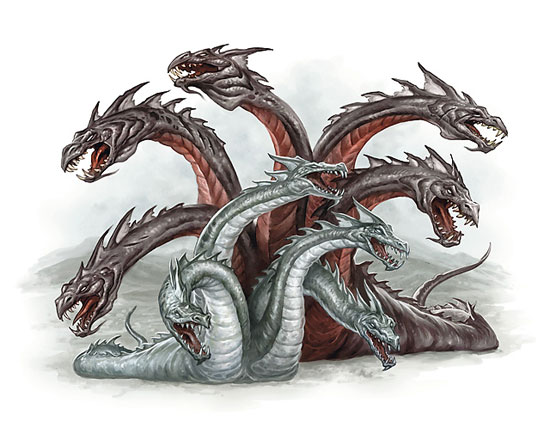

## Hydra

An ancient mythical serpent that possesses many heads.
This is the successor to our
[flags iOS app](https://itunes.apple.com/us/app/flags!-build-guess/id923752952).

## Motivation

- We'd like to expand into different subject areas, not just flags. Therefore,
this app will be entirely data-driven from a content management system.

- We'd like to increase our audience to Android and web users. Therefore, this
app will be written using a hexagonal architecture that can be adapted to
different platforms.

- We'd like to make small changes, without needing to release new versions.
Therefore, this app will decouple application code from the data that drives it.

- We'd like to introduce a mature testing approach to promote change. Therefore,
this app will be test-driven from business requirements.

## Work in progress

This app is in the early stages of development. It has not been released yet.
